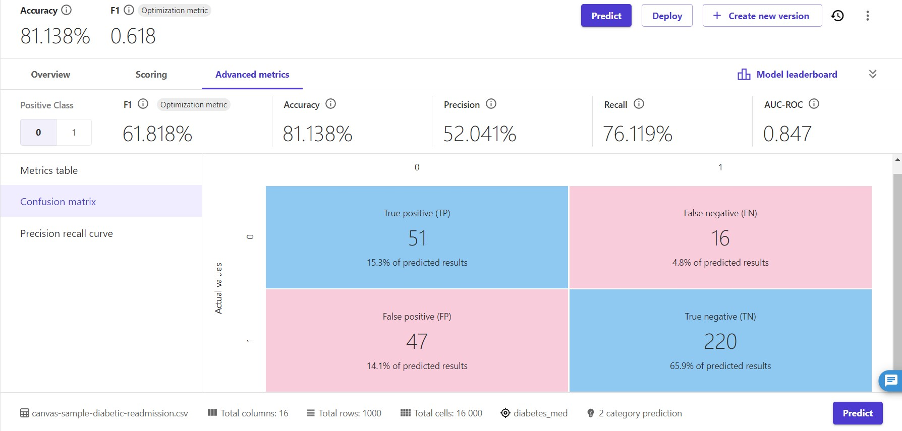

# 📊 Previsão de Diabetes na AWS com [SageMaker Canvas](https://aws.amazon.com/pt/sagemaker/canvas/)

O meu projeto foi para prever diabetes de pacientes, usei a a base de dados que a AWS fornece e meus resultados foram bem satisfatórios.

# 👉 Resumo dos Resultados do Modelo de Previsão de Diabetes
## 1. Acurácia (Accuracy)
*Valor: 81.138%*

Descrição: A acurácia é a proporção de todas as previsões corretas (tanto positivas quanto negativas) em relação ao total de casos. Com uma acurácia de 81.138%, o modelo está corretamente prevendo a presença ou ausência de diabetes em aproximadamente 81% dos casos.
## 2. F1-Score
*Valor: 0.618 (ou 61.8%)*

Descrição: O F1-Score é a média harmônica da precisão e recall, fornecendo uma única métrica para avaliar a performance do modelo com um equilíbrio entre precisão e recall. Com um F1-Score de 0.618, o modelo mostra um desempenho razoável em prever corretamente os casos positivos de diabetes.
## 3. Precisão (Precision)
*Valor: 52.041%*

Descrição: A precisão é a proporção de verdadeiros positivos em relação ao total de positivos previstos (TP / (TP + FP)). Com uma precisão de 52.041%, o modelo indica que quando ele prevê diabetes, está correto em 52% das vezes.
## 4. Recall (Recall)
*Valor: 76.119%*

Descrição: O recall é a proporção de verdadeiros positivos em relação ao total de positivos reais (TP / (TP + FN)). Com um recall de 76.119%, o modelo é capaz de identificar 76% dos casos de diabetes presentes no conjunto de dados.
## 5. AUC-ROC
*Valor: 0.847*

Descrição: A AUC-ROC (Área sob a Curva da Característica de Operação do Receptor) mede a capacidade do modelo de distinguir entre classes. Com uma AUC-ROC de 0.847, o modelo tem uma excelente capacidade de diferenciar entre pacientes com e sem diabetes.
Matriz de Confusão
Predicted / Actual	0	1
0	220 (TN)	16 (FN)
1	47 (FP)	51 (TP)
Interpretação dos Resultados da Matriz de Confusão
True Positive (TP):

### *Valor: 51 (15.3% dos resultados previstos)*

Descrição: Casos onde o modelo previu corretamente a presença de diabetes.
False Negative (FN):

### *Valor: 16 (4.8% dos resultados previstos)*

Descrição: Casos onde o modelo falhou ao prever a presença de diabetes, mas o paciente realmente tem diabetes.
False Positive (FP):

### *Valor: 47 (14.1% dos resultados previstos)*

Descrição: Casos onde o modelo previu diabetes erroneamente, mas o paciente não tem diabetes.
True Negative (TN):

### *Valor: 220 (65.9% dos resultados previstos)*

Descrição: Casos onde o modelo previu corretamente a ausência de diabetes.

# Conclusão 📊
Meu modelo de Machine Learning para previsão de diabetes apresentou uma boa acurácia de 81.138% e um AUC-ROC de 0.847, indicando uma boa capacidade de distinção entre pacientes com e sem diabetes. No entanto, a precisão de 52.041% sugere que há um número significativo de falsos positivos, enquanto o recall de 76.119% indica que o modelo está bem em identificar casos de diabetes. O F1-Score de 0.618 fornece uma visão equilibrada do desempenho geral do modelo.
